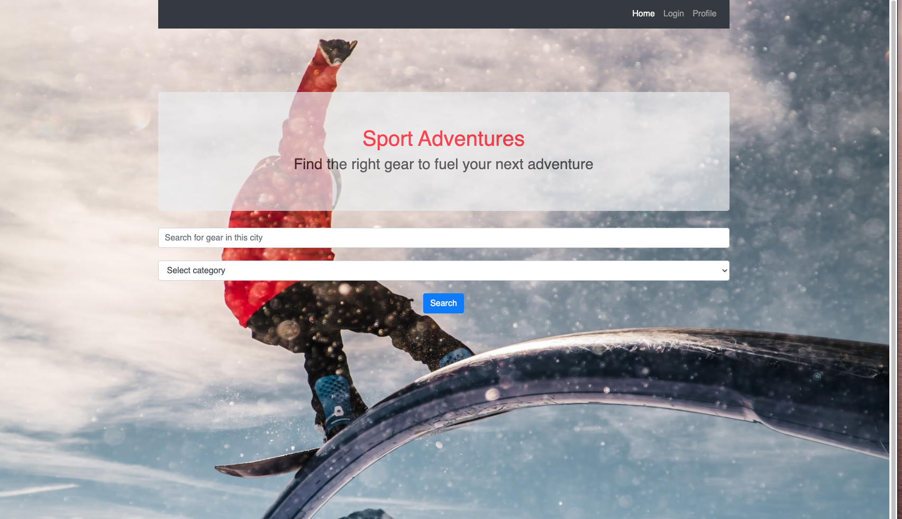

# sport adventures
## Deployed App on Heroku
### https://boiling-mountain-96486.herokuapp.com/

## Description
React application that allows sport and adventure enthusiasts to share gear amongst themselves. Users have the option to rent sports equipment when travelling , or just try something before committing to buy, or rent out items they own for a profit...  

## Table of Contents
#### [Installation](https://github.com/nigarabdullayeva/project_3#installation-1)
#### [Usage information](https://github.com/nigarabdullayeva/project_3#usage-information-1)
#### [License](https://github.com/nigarabdullayeva/project_3#license-1)
#### [Contributing](https://github.com/nigarabdullayeva/project_3#contributing-1)
#### [Technologies](https://github.com/nigarabdullayeva/project_3#technologies-1)
#### [Questions](https://github.com/nigarabdullayeva/project_3#questions-)

## Installation
Run 'npm start' in terminal to install dependencies

## Usage information
Run 'npm start' in terminal

## License
MIT

## Contributing
Pull requests are welcome

## Technologies
React - for components,state,routing
Node.js - for JS runtime environment
Bootstrap - for responsive style
MongoDB,Mongoose - database for storing listed items information
Firebase - for user authentication and encryption
Firebase storage - for storing images
JS/ES6+ - for program logic
HTML - layout
CSS - for custom style
axios - for API calls

## Questions ?
### https://github.com/cd-prog
### https://github.com/nigarabdullayeva
### https://github.com/DewdropStudio
### https://github.com/CarsonK2112

